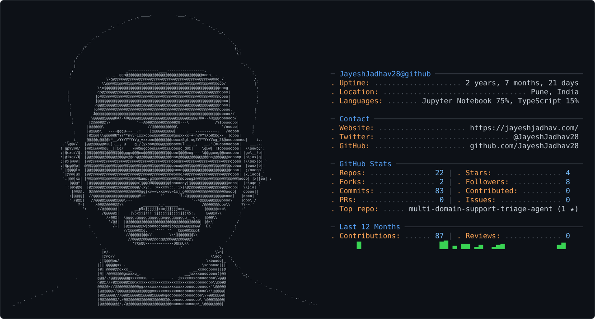

<picture>
  <source media="(prefers-color-scheme: dark)" srcset="dark_mode.svg" />
  <source media="(prefers-color-scheme: light)" srcset="light_mode.svg" />
  
</picture>

<div align="center">

```
     ██╗ █████╗ ██╗   ██╗███████╗███████╗██╗  ██╗
     ██║██╔══██╗╚██╗ ██╔╝██╔════╝██╔════╝██║  ██║
     ██║███████║ ╚████╔╝ █████╗  ███████╗███████║
██   ██║██╔══██║  ╚██╔╝  ██╔══╝  ╚════██║██╔══██║
╚█████╔╝██║  ██║   ██║   ███████╗███████║██║  ██║
 ╚════╝ ╚═╝  ╚═╝   ╚═╝   ╚══════╝╚══════╝╚═╝  ╚═╝
```

### `> Full Stack Web Developer · Freelancer · Builder of Real Things`

[](https://git.io/typing-svg)

[](https://jayeshjadhav.com)
[](https://www.linkedin.com/in/jayesh-jadhav-connect/)
[](mailto:jayeshjadhav6480@gmail.com)
[](https://jayeshjadhav.com)

</div>

---

## `whoami`

```javascript
const jayesh = {
  role       : "Full Stack Web Developer & Freelancer",
  location   : "Pune, Maharashtra 🇮🇳",
  education  : "B.Tech CSE @ DIET, Satara (2023–2027)",
  currentWork: ["Tech Lead @ XFounders (DIET E-Cell)", "Campus Ambassador @ E-Cell IIT Bombay"],
  stack      : ["React.js", "Next.js", "Node.js", "Express.js", "MongoDB", "Firebase"],
  shipped    : "30,000+ real users served across production apps 🚀",
  superpower : "Turning ideas into deployed, scalable digital products",
  hobbies    : ["Traveling 🌍", "History 📜", "Photography 📸", "Hackathons ⚡"],
  openTo     : ["Freelance Projects", "Internships", "Startup Collabs"],
};
```

---

## `⚡ Tech Arsenal`

<div align="center">

**Frontend**


**Backend & Database**


**Languages**


**Tools & Deployment**


</div>

---

## `🚀 Production Projects — Real Users. Real Impact.`

<table>
<tr>
<td width="50%">

### 🛕 [Panchapali Durgamata Mandir](https://panchapalidurgamata.org)
**Stack:** `Next.js` `Tailwind CSS` `Node.js` `Firebase`

- ⚡ **30,000+ visitors** served with **zero downtime** during peak festivals
- 🏎️ Page load **< 1.5s** via SSR + image optimization
- 📱 **70%+ mobile users** — fully responsive UI
- 👤 **Sole developer** — from wireframe to deployment

</td>
<td width="50%">

### 🏭 [Bluewings Polymer](https://bluewingspolymer.com)
**Stack:** `Next.js` `Tailwind CSS` `Node.js` `Firebase`

- 📈 Increased online inquiries by **50%** post-launch
- ⚡ Load time **< 2s** via static generation
- 🏢 Professional B2B site for Pune-based manufacturer
- 🎯 Focused on lead conversion & brand trust

</td>
</tr>
<tr>
<td width="50%">

### 💸 SmartSpend Snap — AI Finance Tracker
**Stack:** `React.js` `Node.js` `Express.js` `MongoDB` `Gemini API` `Firebase`

- 🤖 Integrated **Google Gemini API** for real-time saving insights
- 🔐 Secure **Firebase Auth** + MongoDB for 1,000+ entries
- 📊 Full-stack RESTful API architecture

</td>
<td width="50%">

### 🌱 Smart Campus QR Code Tree Initiative
**Stack:** `Web` `QR Technology`

- 🌳 Built QR system to digitize tree information across campus
- 💡 Merged **tech + sustainability** in an IoT-inspired project
- 🏫 Live at Dnyanshree Institute of Engineering & Technology

</td>
</tr>
</table>

---

## `📊 GitHub Stats`

<div align="center">


</div>

---

## `🏆 Achievements & Activities`

```
🥇  Tech Lead @ XFounders — Led 4-member dev team, 40% faster launch, 500+ student platform
🎓  Campus Ambassador @ E-Cell IIT Bombay — 200+ students reached, 25% participation boost
⚡  RIT Hackathon 2K25 (AI/ML Track)
🏆  PRABAL National Hackathon 2025 @ Google Developer Group, SGU
🌐  Full Stack Web Development Certified
🎤  Organized "Debug & Build" coding event — 100+ participants
```

---

## `📡 Connect with me`

<div align="center">

[](https://jayeshjadhav.com)
[](mailto:jayeshjadhav6480@gmail.com)

</div>

---

<div align="center">

```
╔══════════════════════════════════════════════════════════════╗
║   "Let's build something bold enough to be remembered."    ║
╚══════════════════════════════════════════════════════════════╝
```

</div>

<!-- Snake Animation -->
<div align="center">
  <picture>
    <source media="(prefers-color-scheme: dark)" srcset="https://raw.githubusercontent.com/JayeshJadhav28/JayeshJadhav28/output/github-snake-dark.svg" />
    <source media="(prefers-color-scheme: light)" srcset="https://raw.githubusercontent.com/JayeshJadhav28/JayeshJadhav28/output/github-snake.svg" />
    
  </picture>
</div>

<!-- Footer -->
<div align="center">


<br/>

⭐ **If you like what I build — star a repo. Let's connect and ship something great together.**


</div>
